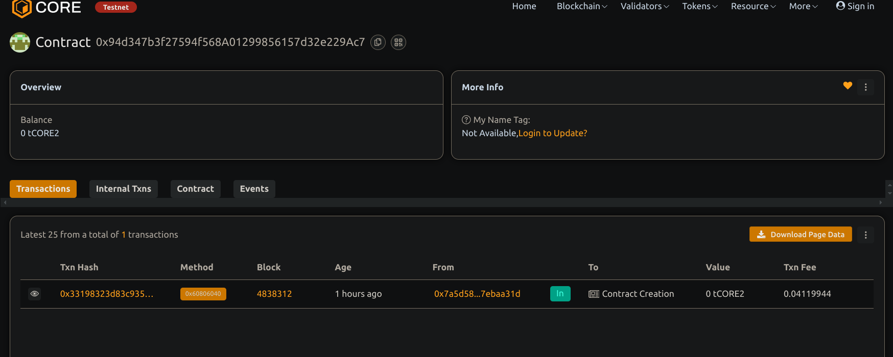

# Perpetual Futures Contract with Funding Rate Mechanism

## Project Description

A Solidity smart contract that enables users to trade perpetual futures with margin and includes a funding rate mechanism to balance long and short positions. It simulates funding payments over time and tracks user positions.

## Project Vision

To provide a decentralized and gas-efficient framework for implementing perpetual futures contracts, offering dynamic funding rates and basic PnL computation, paving the way for more advanced DeFi derivatives.

## Key Features

- Long and short perpetual futures with margin
- Dynamic funding rate in basis points (BPS)
- Time-based funding payment calculation
- PnL based on price movements
- Real-time price updates (mocked for demo purposes)

## Future Scope

- Integrate real-time Chainlink price feeds
- Add liquidation logic with risk thresholds
- Include position size caps and leverage settings
- Enable off-chain bots to settle funding
- Expand to cross-margin and isolated margin modes

## Contract details
0x94d347b3f27594f568A01299856157d32e229Ac7

Made By :- Digvijay Chouhan 
23/07/2025

 
